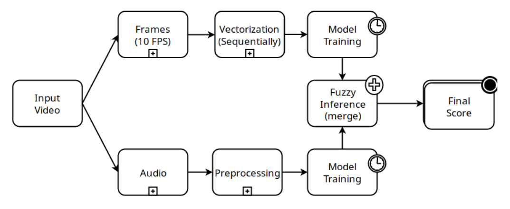

# Violence Detection from audio and video

### Abstract

```
The purpose of this project is to provide a high-end security system. We have built a system that
detects violence from both video and audio. The finalized system consists of 3 subsystems: 1)
Violence detection engine for video 2) Violence detection engine for audio 3) An inference system
for combining results of the previous subsystems. The difference with this approach is the improved
detection capability when using state of the art machine learning techniques. Recent computing
capabilities has enabled the use of more and more sophisticated learning algorithms on ever more
powerful computers to learn from dense existing datasets. This project uses detection models that are
built on top of such renowned models such as Convolutional Neural Networks (CNN), Artificial
Neural Networks (ANN), and Long Short-Term Memory (LSTM) for video classification and
Support Vector Machine (SVM) for audio classification. Fuzzy logic is applied to seamlessly glue
together the video classification and audio classification models for greater detection rates.
```
### System Workflow

<hr>




### Usage

Run <b>predict.py</b> to predict frame and <b>vgg16.py</b> to train vgg16 pretrained model.
```python
inference/
          predict.py
          vgg16.py
          vgg16_model.h5        
```
<hr>
<b> All other directories:</b>
<br>

```
all_test_scripts/
              # store all other approach
              # of violence classification
     
     
audio_process/
              # audio classification works are here
              

frame_extractor/
              # extract frames using these scripts
              run.py
              vtf.py
              

web_templates/
              # web application files (Ex. HTML, CSS)
```
### Flask App

- Extract <b>server.rar</b>
- run `python app.py`


## Another Work

#### To explore more check - https://github.com/niyazed/violence-video-classification
